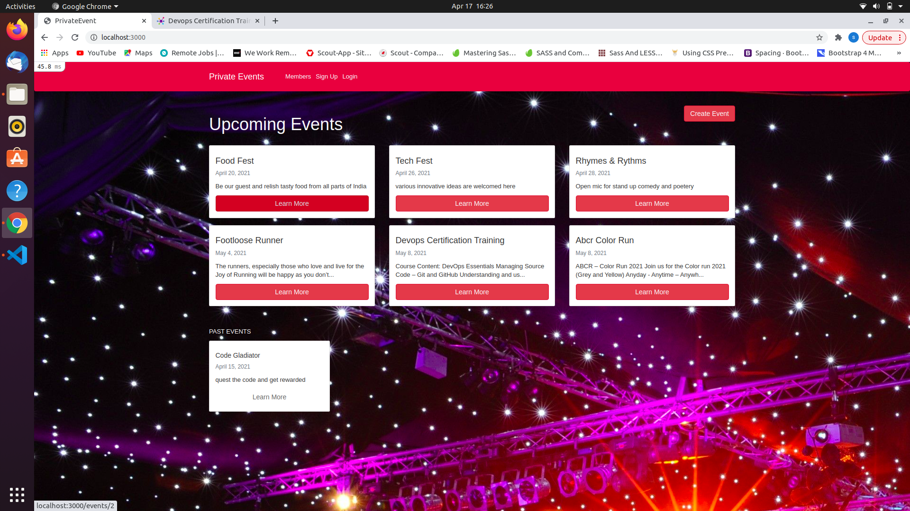
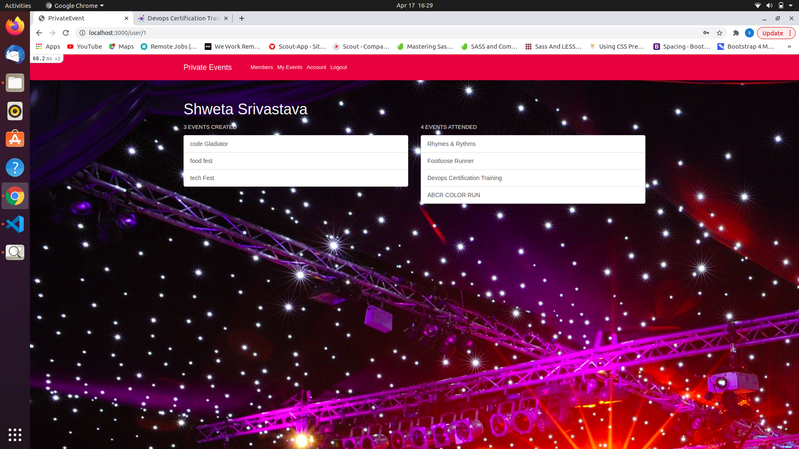
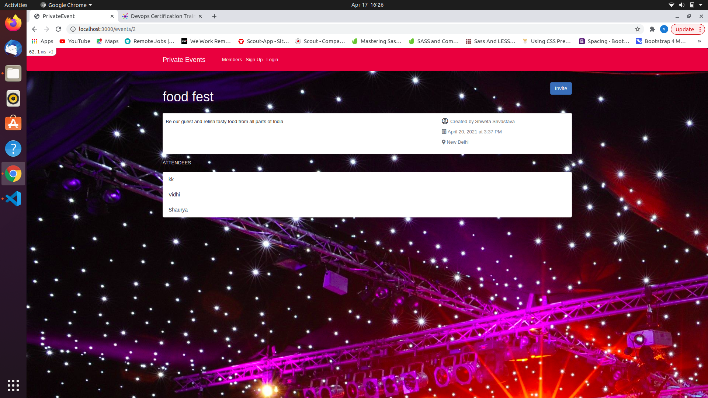
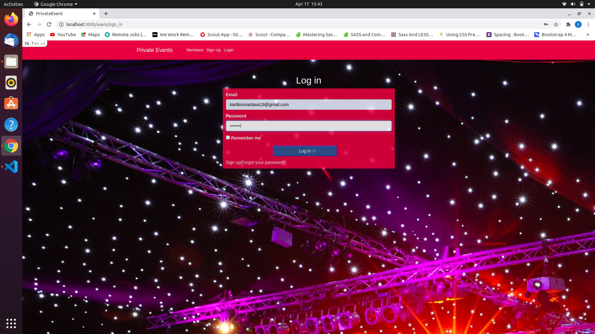

# README

# Private_Events

> In This project authenticated user can created events,participate in any event, Every event page has the the list of attendees, Each event has a scope past to which event is sent to past event, project is built with Rails.

Full project description - [Click here](https://www.theodinproject.com/paths/full-stack-ruby-on-rails/courses/ruby-on-rails/lessons/associations)

## Built With
- [RubyOnRails](https://rubyonrails.org/)

## Prerequisite
- Ruby on rails

### Instructions

- Download or clone this repo.
https://https://github.com/vidhishweta01/PrivateEvents
- From your terminal, `cd` into the repo directory

Enter the proper branch by-
 git checkout feature

 -Run bin/yarn install, in order to prevent Webpacker::Manifest::MissingEntryError in Devise::Sessions#new error

-run `bundle install`.
- 
Run the command `rails db:create`. This will initialize the necessary migration files.
-
 Run the command `rails db:migrate`.

### Usage

- Run the command `rails s`.
- Open http://localhost:3000/ and create a user. 
- You can then edit that user.

## Authors

👤 **Author**

- GitHub: [@ShwetaSrivastava](https://github.com/vidhishweta01)
- Twitter: [@ShwetaSrivastava](https://twitter.com/vidhishweta01)
- LinkedIn: [ShwetaSrivastava](https://www.linkedin.com/in/vidhishweta01/)

## 🤝 Contributing

Contributions, issues, and feature requests are welcome!

Feel free to check the [issues page](issues/).

## Show your support

Give a ⭐️ if you like this project!

## Acknowledgments

- Hat tip to anyone whose code was used
- Inspiration
- etc

## 📝 License

This project is [MIT](LICENSE) licensed.

